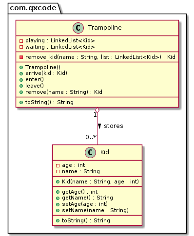

# Pula pula & Movendo objetos entre duas listas

<!--TOC_BEGIN-->
- [Pula pula & Movendo objetos entre duas listas](#pula-pula--movendo-objetos-entre-duas-listas)
  - [Requisitos](#requisitos)
  - [Shell](#shell)
  - [Diagrama](#diagrama)
  - [Esqueleto](#esqueleto)
<!--TOC_END-->


Nosso objetivo no trabalho é modelar um gestor de pula pulas em um parquinho.

## Requisitos
- Inserir crianças na fila de espera do pula pula
- Mover a primeira criança da fila de espera do pula pula para dentro do pula pula.
- Mover a primeira criança que entrou no pula pula para o final da fila de espera.


## Shell
```bash
#__case unico
# $chegou _nome _idade
# insere uma criança na fila de entrada do brinquedo
$arrive mario 5
$arrive livia 4
$arrive luana 3

# show
# mostra a fila de entrada e o pula pula
$show
=> luana:3 livia:4 mario:5 => [ ]

#__case entrando
# entrar
# tira a primeira criança da fila de entrada e insere no pula pula

$enter
$show
=> luana:3 livia:4 => [ mario:5 ]
$enter
$show
=> luana:3 => [ livia:4 mario:5 ]

#__case saindo
$leave
$show
=> mario:5 luana:3 => [ livia:4 ]

#__case remove
$remove luana
$show
=> mario:5 => [ livia:4 ]
$remove livia
$show
=> mario:5 => [ ]
$end
```
***
## Diagrama

***
## Esqueleto
<!--FILTER Solver.java java-->
```java
class Kid {
    private int age;
    private String name;
    public Kid(String name, int age);
    public int getAge();
    public String getName();
    public void setAge(int age);
    public void setName(String name);
    public String toString();
}
class Trampoline{
    private LinkedList<Kid> waiting;
    private LinkedList<Kid> playing;
    public Trampoline();
    //procura nas lista passada por parametro a criança
    //utilizando o nome
    //se encontrar, remove a criança da lista e retorna
    //retorna null se não encontrar
    private Kid remove_kid(String name, LinkedList<Kid> list);
    //insere na lista de espera
    public void arrive(Kid kid);
    //se existir alguém na lista de espera
    //remove o que estiver na frente da lista
    //e insere na no fim da lista de playing
    public void enter();
    //se existir alguém em playing, remove o primeiro da lista
    //e insere no final da lista de espera
    public void leave();
    //procura a criança no parquinho e remove
    //utilize a função privada remove_kid passando
    //as listas waiting e playing uma por vez
    //para procurar e remover a criança
    public Kid remove(String name);
    public String toString();
}
class Solver {
    public static void main(String[] args) {
        Scanner scanner = new Scanner(System.in);
        Trampoline tramp = new Trampoline();
        while(true) {
            String line = scanner.nextLine();
            System.out.println("$"+ line);
            String[] ui = line.split(" ");
            if(ui[0].equals("end")) {
                break;
            } else if(ui[0].equals("arrive")) { // name age
                tramp.arrive(new Kid(ui[1], Integer.parseInt(ui[2]))) ;
            } else if(ui[0].equals("enter")) {
                tramp.enter();
            } else if(ui[0].equals("leave")) {
                tramp.leave();
            } else if(ui[0].equals("remove")) {//name
                tramp.remove(ui[1]);
            } else if(ui[0].equals("show")) {
                System.out.println(tramp);
            } else {
                System.out.println("fail: comando invalido");
            }
        }
        scanner.close();
    }
}

class Manual {
    public static void main(String[] args) {
        
        //case unico
        Trampoline trampoline = new Trampoline();
        trampoline.arrive(new Kid("mario", 5));
        trampoline.arrive(new Kid("livia", 4));
        trampoline.arrive(new Kid("luana", 3));
        System.out.println(trampoline);
        //=> luana:3 livia:4 mario:5 => [ ]

        //case entrando
        trampoline.enter();
        System.out.println(trampoline);
        //=> luana:3 livia:4 => [ mario:5 ]
        trampoline.enter();
        System.out.println(trampoline);
        //=> luana:3 => [ livia:4 mario:5 ]

        //case saindo
        trampoline.leave();
        System.out.println(trampoline);
        //=> mario:5 luana:3 => [ livia:4 ]
    }
}
```
<!--FILTER_END-->