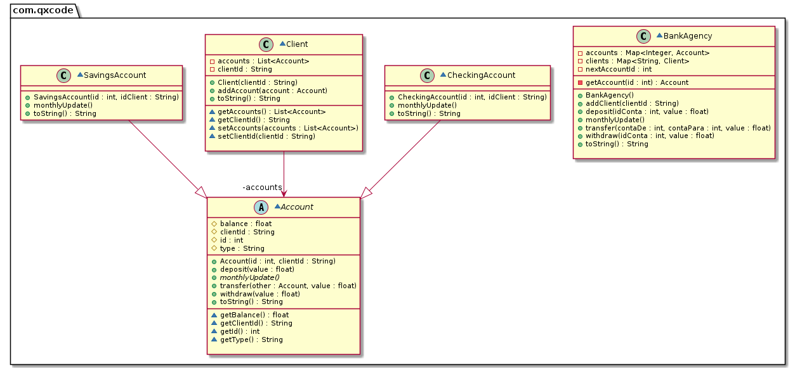

# Cadastro & Banco 2 (herança, método abstrato, polimorfismo)


<!--TOC_BEGIN-->
- [Cadastro & Banco 2 (herança, método abstrato, polimorfismo)](#cadastro--banco-2-herança-método-abstrato-polimorfismo)
  - [Requisitos](#requisitos)
  - [Shell](#shell)
  - [Diagrama](#diagrama)
  - [Esqueleto](#esqueleto)
  - [Solução](#solução)
<!--TOC_END-->

O objetivo dessa atividade é implementar uma agência bancária simplificada. Deve ser capaz de cadastrar cliente. Cada cliente inicia com uma conta poupança e uma conta corrente. Contas correntes tem taxa de administração e contas poupanças rendem juros.

## Requisitos

- Cadastrar um cliente com idCliente único
    - Quando o cliente é cadastrado no sistema, automaticamente é aberta uma conta corrente e uma conta poupança para ele.
- Mensalmente:
    - Contas corrente vão receber uma tarifa de **20 reais** podendo inclusive ficar negativas.
    - Contas poupança vão aumentar de 1 porcento.
- Sua agência deve ter um mapa de clientes e um mapa de contas.
- O cliente só tem duas contas, mas imagine que no futuro ele poderá ter várias.
- As contas devem ser tratadas utilizando polimorfismo.


## Shell

```bash
#__case first clients
# addCli _idCliente
# adiciona um cliente na lista de clientes.
# cria uma conta poupança e uma conta corrente para cada cliente usando numeração de forma sequencial.
$addCli Almir
$addCli Julia
$addCli Maria

# show mostra as contas do banco, com id:usuario:saldo:tipo
# em tipo use CC para conta corrente e CP para conta poupança.
$show
Clients:
- Almir [0, 1]
- Julia [2, 3]
- Maria [4, 5]
Accounts:
0:Almir:0.00:CC
1:Almir:0.00:CP
2:Julia:0.00:CC
3:Julia:0.00:CP
4:Maria:0.00:CC
5:Maria:0.00:CP

######################################
#__case operações básicas
#faça as operações básicas de saque, depósito e transferência entre contas
#verifique se as contas existem antes de efetuar as operações
# $saque _conta _value
# para sacar verifique o saldo
#
# $deposito _conta _value
#
# $transf _contaDe _contaPara _value

$deposito 0 100
$deposito 1 200
$deposito 2 50
$deposito 3 300
$saque 3 50
$saque 0 70
$saque 1 300
fail: saldo insuficiente

$show
Clients:
- Almir [0, 1]
- Julia [2, 3]
- Maria [4, 5]
Accounts:
0:Almir:30.00:CC
1:Almir:200.00:CP
2:Julia:50.00:CC
3:Julia:250.00:CP
4:Maria:0.00:CC
5:Maria:0.00:CP

$transf 3 5 200
$transf 0 4 25
$transf 9 1 30
fail: conta nao encontrada
$transf 2 8 10
fail: conta nao encontrada

$show
Clients:
- Almir [0, 1]
- Julia [2, 3]
- Maria [4, 5]
Accounts:
0:Almir:5.00:CC
1:Almir:200.00:CP
2:Julia:50.00:CC
3:Julia:50.00:CP
4:Maria:25.00:CC
5:Maria:200.00:CP

#__case update mensal
# No comando update todas as contas serão atualizadas.
# Contas corrente vão receber uma tarifa de 20 reais podendo inclusive ficar negativas.
# Contas poupança vão aumentar de 1 porcento.
$update

$show
Clients:
- Almir [0, 1]
- Julia [2, 3]
- Maria [4, 5]
Accounts:
0:Almir:-15.00:CC
1:Almir:202.00:CP
2:Julia:30.00:CC
3:Julia:50.50:CP
4:Maria:5.00:CC
5:Maria:202.00:CP
$end

```

***
## Diagrama



***
## Esqueleto
<!--FILTER Solver.java java-->
```java
//excessão lançada em quaisquer erros relacionados à conta
class AccountException extends RuntimeException {
    public AccountException(String message) {
        super(message);
    }
}
abstract class Account {
    protected int id;
    protected float balance;
    protected String clientId;
    protected String type; //CC or CP
    public Account(int id, String clientId);
    //abstract method
    public abstract void monthlyUpdate();
    //saque
    public void withdraw(float value);
    //deposito
    public void deposit(float value);
    //transferencia para outra conta
    public void transfer(Account other, float value);
    public String toString();
    //GETS and SETS
    int getId();
    float getBalance();
    String getClientId();
    String getType();
}
class CheckingAccount extends Account {
    //inicializa conta.type com "CC"
    public CheckingAccount(int id, String idClient);
    //retira 20 do saldo
    public void monthlyUpdate();
}
class SavingsAccount extends Account {
    public SavingsAccount(int id, String idClient);
    //aumenta saldo em 1%
    public void monthlyUpdate();
}
class Client {
    private String clientId;
    private List<Account> accounts;
    public Client(String clientId);
    public void addAccount(Account account);
    public java.lang.String toString();
    //GETS and SETS
    String getClientId();
    void setClientId(String clientId);
    List<Account> getAccounts();
    void setAccounts(List<Account> accounts);
};
class BankAgency {
    private Map<String, Client> clients;
    private Map<Integer, Account> accounts;
    private int nextAccountId = 0;
    //obtém conta ou lança excessão
    private Account getAccount(int id);
    public BankAgency();
    //se o cliente não existir
    //cria o cliente
    //cria uma conta poupança e uma conta corrent para o cliente
    //adiciona essas contas no vetor de contas e no vetor do cliente
    //adiciona o cliente no mapa de clientes
    public void addClient(String clientId);
    //obtem o cliente e invoca as ações
    public void withdraw(int idConta, float value);
    public void deposit(int idConta, float value);
    public void transfer(int contaDe, int contaPara, float value);
    public void monthlyUpdate();
    public String toString();
};
class Solver{
    public static void main(String[] args) {
        Scanner scanner = new Scanner(System.in);
        BankAgency agency = new BankAgency();
        while(true){
            try {
                String line = scanner.nextLine();
                System.out.println("$" + line);
                String ui[] = line.split(" ");
                if(line.equals("end")) {
                    break;
                } else if(ui[0].equals("show")) {
                    System.out.println(agency);
                } else if(ui[0].equals("addCli")) {
                    agency.addClient(ui[1]);
                } else if(ui[0].equals("saque")) { //accountId value
                    agency.withdraw(Integer.parseInt(ui[1]), Float.parseFloat(ui[2]));
                } else if(ui[0].equals("deposito")) {//accountId value
                    agency.deposit(Integer.parseInt(ui[1]), Float.parseFloat(ui[2]));
                } else if(ui[0].equals("transf")) {//from to value
                    agency.transfer(Integer.parseInt(ui[1]), Integer.parseInt(ui[2]), Float.parseFloat(ui[3]));
                } else if(ui[0].equals("update")) {
                    agency.monthlyUpdate();
                } else {
                    System.out.println("fail: comando invalido");
                }
            } catch (AccountException ae) {
                System.out.println(ae.getMessage());
            }
        }
        scanner.close();
    }
}
```
## Solução


```cpp
#include <iostream>
#include <map>
#include <vector>
#include <memory>

class Conta{
    protected:
        float balance;
        std::string clientId;
        int id = 0;
        std::string type = "Conta";

    public:
    Conta(int id, std::string clientId){
        this->id = id;
        this->clientId = clientId;
    };

    virtual void monthlyUpdate() = 0;

    void deposit(float value){
        this->balance += value;
    }

    void withdraw(float value){
        if(value>this->balance){
            std::cout << "Saldo insuficiente na conta:" << getId() << std::endl;       
        }else{
            this->balance -= value;
        }
    }

    void transfer(std::shared_ptr<Conta> destino, float valor){
        if(destino == nullptr){
            std::cout << "Conta não encontrada" << std::endl;
        }else{
            this->withdraw(valor);
            destino->deposit(valor);
        }

    }

    float getBalance(){
        return this->balance;
    }

    std::string getClientId(){
        return this->clientId;
    }

    int getId(){
        return this->id;
    }

    std::string getType(){
        return this->type;
    }

    friend std::ostream& operator<<(std::ostream& os, Conta& conta){
        os<< "Dados da conta: " << std::endl;
        os << "Id: " << conta.getId() << " Cliente: " << conta.getClientId() << " Saldo: " << conta.getBalance() << " Type: " << conta.getType() << std::endl;
        return os;
    }

};

class Poupanca : public Conta{
    private:

    public:
    Poupanca (int id,std::string clientId) : Conta(id, clientId){
        this->type = "ContaP";
    }

    void monthlyUpdate(){
        this->balance += 0.01;
    }
};

class Corrente : public Conta{
    private:

    public:

    Corrente (int id,std::string clientId) : Conta(id, clientId){
        this->type = "ContaC";
    }

    void monthlyUpdate(){
        this->balance -= 20;
    }

    
};

class Cliente{
    private:
    std::vector <std::shared_ptr<Conta>> contas;
    std::string clientId;
    public:
    Cliente(std::string clientId){
        this->clientId = clientId;
    };

    void addConta(std::shared_ptr<Conta> account){
        this->contas.push_back(account);
    }


    std::vector<std::shared_ptr<Conta>> getContas(){
        return this->contas;
    }

    std::string getClientId(){
        return this->clientId;
    }

    friend std::ostream& operator<<(std::ostream& os, Cliente& cliente){
        os << "Cliente:  " << cliente.clientId << " [";

        for (int i = 0; i < (int) cliente.contas.size(); i++) {
            if (i > 0) {
                os << ", " << cliente.contas[i]->getId();
            } else {
                os << cliente.contas[i]->getId();
            }
        }
        os << "]";
        return os;
    }
};

class Banco {
    private:
        std::map<int, std::shared_ptr<Conta>> contas;
        std::map<std::string,std::shared_ptr<Cliente>> clientes;
        int nextAccountId = 0;
    public:
    
    Banco(){}
    
    void addCliente(std::string clientId){
        std::shared_ptr<Cliente> clienteNovo = std::make_shared<Cliente>(clientId);
        this->clientes.insert(std::pair<std::string,std::shared_ptr<Cliente>>(clientId,clienteNovo));
        
        std::shared_ptr<Corrente> cCorrente = std::make_shared<Corrente>(this->nextAccountId,clientId);
        this->contas.insert(std::pair<int,std::shared_ptr<Conta>>(this->nextAccountId,cCorrente));
        nextAccountId+=1;
        
        std::shared_ptr<Poupanca> cPoupanca = std::make_shared<Poupanca>(this->nextAccountId,clientId);        
        this->contas.insert(std::pair<int,std::shared_ptr<Conta>>(this->nextAccountId,cPoupanca));
        nextAccountId+=1;
        clienteNovo->addConta(cCorrente);
        clienteNovo->addConta(cPoupanca);
    }
    void deposit(int Idconta, float valor){
        this->contas[Idconta]->deposit(valor);
    }
    void monthlyUpdate(){
        for(auto &c : this->contas){
            c.second->monthlyUpdate();
        }
    }
    
    void transfer(int contaDe, int contaPara, float valor){
        this->contas[contaDe]->transfer(this->contas[contaPara],valor);
    }
    
    void withdraw(int idConta, float Valor){
        this->contas[idConta]->withdraw(Valor); 
    }

    friend std::ostream& operator<<(std::ostream& os, Banco& banco){
        os << "Clientes: " << std::endl;
        for(auto c : banco.clientes){
            os << *(c.second) << std::endl;
        }
        os << "Contas: " << std::endl;
        for(auto c : banco.contas){
            os << *(c.second) << std::endl;
        }
        return os;
    }
        
};

int main (){

    Banco banco;
    banco.addCliente("123");
    banco.addCliente("456");
    banco.deposit(0,100);
    banco.deposit(1,200);
    banco.deposit(2,300);
    banco.deposit(3,400);
    banco.monthlyUpdate();

    while (true){
        using namespace std;
        string comando;
        cout<< "Digite um comando: "<<endl;
        cout << "mostrar, add, depositar, sacar, transferir, atualizar, sair" << endl;
        cin >> comando;

        if(comando == "mostrar"){
            cout << banco << endl;
        }else if(comando == "add"){
            string clienteID;
            cout << "Digite o id do cliente: " << endl;
            cin >> clienteID;
            banco.addCliente(clienteID);
        }else if(comando == "depositar"){
            int idConta;
            float valor;
            cout << "Digite o id da conta: " << endl;
            cin >> idConta;
            cout << "Digite o valor: " << endl;
            cin >> valor;
            banco.deposit(idConta,valor);
        }else if(comando == "sacar"){
            int idConta;
            float valor;
            cout << "Digite o id da conta: " << endl;
            cin >> idConta;
            cout << "Digite o valor: " << endl;
            cin >> valor;
            banco.withdraw(idConta,valor);
        }
        else if(comando == "transferir"){
            int contaDe;
            int contaPara;
            float valor;
            cout << "Digite o id da conta de origem: " << endl;
            cin >> contaDe;
            cout << "Digite o id da conta de destino: " << endl;
            cin >> contaPara;
            cout << "Digite o valor: " << endl;
            cin >> valor;
            banco.transfer(contaDe,contaPara,valor);
        }else if(comando == "atualizar"){
            banco.monthlyUpdate();
        }else if(comando == "sair"){
            break;
        }
    }

    return 0;
}

```
<!--FILTER_END-->
