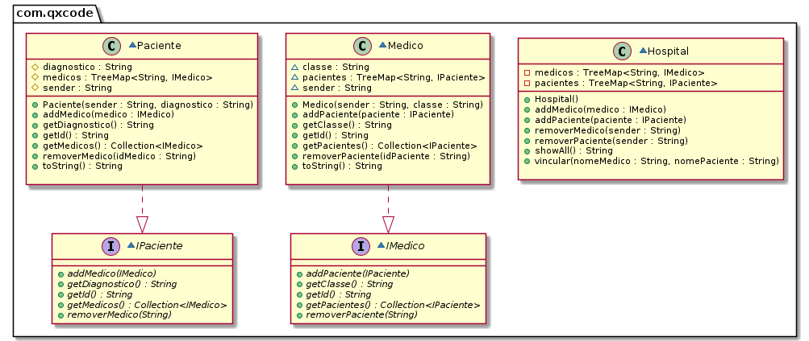

# Hospital I

<!--TOC_BEGIN-->
- [Hospital I](#hospital-i)
  - [Cadastrar Pacientes, Médicos e Plantões.](#cadastrar-pacientes-médicos-e-plantões)
  - [Funcionalidades](#funcionalidades)
  - [Diagrama de Classes](#diagrama-de-classes)
  - [Esqueleto](#esqueleto)
  - [Solução C++](#solução-c)
<!--TOC_END-->


## Cadastrar Pacientes, Médicos e Plantões.


Na UTI do nosso hospital existem vários pacientes. Cada paciente é atendico por médicos de várias especialidades. Pacientes e médicos podem se comunicar via mensagens. O sistema deve ser capaz de: 

- cadastrar pacientes e médicos.
- informar quais os médicos que atendem determinado paciente.
- informar quais pacientes que são atendidos por um médico.


***
## Funcionalidades

- **Repositórios Individuais - 3.0 P**
    - Adicionar pacientes.
        - Cada paciente tem um id(nome) e uma diagnóstico.
    - Adicionar médicos.
        - Cada médico tem um id(nome) e uma especialidade.


```sh
#__case inserir
$addPacs fred-fratura alvis-avc goku-hemorragia silva-sinusite
$addMeds bisturi-cirurgia snif-alergologia facada-cirurgia
$show
Pac: alvis:avc        Meds: []
Pac: fred:fratura     Meds: []
Pac: goku:hemorragia  Meds: []
Pac: silva:sinusite   Meds: []
Med: bisturi:cirurgia Pacs: []
Med: facada:cirurgia  Pacs: []
Med: snif:alergologia Pacs: []


#    - Vincular pacientes e médicos.
#        - Dois médicos da mesma especialidade não podem ser responsáveis pelo mesmo paciente.
#        - O paciente não deve entrar duas vezes na lista do médico e vice-versa.

#__case vincular
# tie _med _pac _pac ...
$tie bisturi fred alvis goku
$tie snif silva alvis
$tie facada goku
fail: ja existe outro medico da especialidade cirurgia
$show
Pac: alvis:avc        Meds: [bisturi, snif]
Pac: fred:fratura     Meds: [bisturi]
Pac: goku:hemorragia  Meds: [bisturi]
Pac: silva:sinusite   Meds: [snif]
Med: bisturi:cirurgia Pacs: [alvis, fred, goku]
Med: facada:cirurgia  Pacs: []
Med: snif:alergologia Pacs: [alvis, silva]

$end
```

***
## Diagrama de Classes


***
## Esqueleto
<!--FILTER Solver.java java-->
```java
interface IPaciente {
    public String getId();
    public void addMedico(IMedico medico);
    public void removerMedico(String idMedico);
    public Collection<IMedico> getMedicos();
    public String getDiagnostico();
}
interface IMedico {
    public String getId();
    public void addPaciente(IPaciente paciente);
    public void removerPaciente(String idPaciente);
    public Collection<IPaciente> getPacientes();
    public String getClasse();
}
class Medico implements IMedico{
    String sender;
    String classe;
    TreeMap<String, IPaciente> pacientes = new TreeMap<>();
    public Medico(String sender, String classe);
    public String getId();
    public void addPaciente(IPaciente paciente);
    public void removerPaciente(String idPaciente);
    public Collection<IPaciente> getPacientes();
    public String getClasse();
    public String toString();
}
class Paciente implements IPaciente {
    protected String sender;
    protected String diagnostico;
    protected TreeMap<String, IMedico> medicos = new TreeMap<>();
    public Paciente(String sender, String diagnostico);
    public String getId();
    public void addMedico(IMedico medico);
    public void removerMedico(String idMedico);
    public Collection<IMedico> getMedicos();
    public String getDiagnostico();
    public String toString();
}
class Hospital {
    private TreeMap<String, IPaciente> pacientes = new TreeMap<>();
    private TreeMap<String, IMedico> medicos = new TreeMap<>();
    public Hospital();
    public void removerPaciente(String sender);
    public void removerMedico(String sender);
    public void addPaciente(IPaciente paciente);
    public void addMedico(IMedico medico);
    public void vincular(String nomeMedico, String nomePaciente);
    public String toString();
}
public class Solver {
    public static void main(String[] args) {
        Scanner scanner = new Scanner(System.in);
        Hospital hospital = new Hospital();

        while (true) {
            String line = scanner.nextLine();
            System.out.println("$" + line);
            List<String> ui = Arrays.asList(line.split(" "));
            if (ui.get(0).equals("end")) {
                break;
            } else if (ui.get(0).equals("addPacs")) {
                ui.stream().skip(1)
                        .forEach(tk -> hospital.addPaciente(new Paciente(tk.split("-")[0], tk.split("-")[1])));
            } else if (ui.get(0).equals("addMeds")) {
                ui.stream().skip(1).forEach(tk -> hospital.addMedico(new Medico(tk.split("-")[0], tk.split("-")[1])));
            } else if (ui.get(0).equals("show")) {
                System.out.print(hospital.toString());
            } else if (ui.get(0).equals("tie")) {
                ui.stream().skip(2).forEach(name -> hospital.vincular(ui.get(1), name));
            } else {
                System.out.println("fail: comando invalido");
            }
        }
    }
}
```

## Solução C++

```cpp
#include <iostream>
#include <memory>
#include <map>

class IMedico;

class IPaciente{
public:
    virtual std::string getId() = 0;
    virtual void addMedico (std::shared_ptr<IMedico> medico) = 0;
    virtual void rmMedico (std::string medId) = 0;
    virtual std::map<std::string, std::shared_ptr<IMedico>> getMedicos () = 0;
    virtual std::string getDianostico () = 0;
    virtual ~IPaciente(){}

};

class IMedico{
public:
    virtual std::string getId () = 0;
    virtual void addPaciente (std::shared_ptr<IPaciente> paciente) = 0;
    virtual void rmPaciente (std::string pacId) = 0;
    virtual std::map<std::string, std::shared_ptr<IPaciente>> getPacientes () = 0;
    virtual std::string getClasse( ) = 0;
    virtual ~IMedico(){}
};


class Medico : public IMedico{
    std::string idMed;
    std::string classe;
    std::map <std::string, std::shared_ptr<IPaciente>> pacientes;
    
    public:
    Medico (std::string Id, std::string classe){
        this->idMed = Id;
        this->classe = classe;
    }
    
    void addPaciente (std::shared_ptr<IPaciente> paciente)override{
      this->pacientes.insert(std::pair<std::string, std::shared_ptr<IPaciente>>(paciente->getId(), paciente));    
    }
    void rmPaciente(std::string Idpaciente)override{
        this->pacientes.erase(Idpaciente);
    }

    std::string getClasse()override{
        return classe;
    }
    std::map <std::string, std::shared_ptr<IPaciente>> getPacientes()override{
        return pacientes;
    }
    std::string getId()override{
        return idMed;
    }

};

class Paciente : public IPaciente{
    std::string idPac;
    std::string diagnostico;   
    std::map <std::string, std::shared_ptr<IMedico>> medicos;
    public:
    Paciente (std::string Id, std::string dianostico){
        this->idPac = Id;
        this->diagnostico = dianostico;
    }
    
    void addMedico(std::shared_ptr<IMedico> medico)override{
      this->medicos.insert(std::pair<std::string, std::shared_ptr<IMedico>>(medico->getId(), medico));
    }
    void rmMedico(std::string idMedico)override{
        this->medicos.erase(idMedico);
    }

    

    std::string getDianostico(){
        return diagnostico;
    }
    
    std::map<std::string, std::shared_ptr<IMedico>> getMedicos ()override{
        return medicos;
    }

    std::string getId (){
        return idPac;
    }

};


class Hospital{
    std::map <std::string, std::shared_ptr<IMedico>> medicosH;
    std::map <std::string, std::shared_ptr<IPaciente>> pacientesH;
    public:
    Hospital(){
        std::cout << "Hospital criado" << std::endl;
    }
    
    void addPaciente(std::shared_ptr<IPaciente> paciente){
        this->pacientesH.insert(make_pair(paciente->getId(), paciente));
    }
    void addMedico(std::shared_ptr<IMedico> medico){
        this->medicosH.insert(make_pair(medico->getId(), medico));
    }
    
    void rmPaciente(std::string Id){
        this->pacientesH.erase(Id);
    }
    void rmMedico(std::string Id){
        this->medicosH.erase(Id);
    }

    void vincular(std::string nomeMedico, std::string nomePaciente){
        std::shared_ptr<IMedico> medico = this->medicosH.find(nomeMedico)->second;
        std::shared_ptr<IPaciente> paciente = this->pacientesH.find(nomePaciente)->second;
        medico->addPaciente(paciente);
        paciente->addMedico(medico);  
    }

    void desvincular(std::string nomeMedico, std::string nomePaciente){
        std::shared_ptr<IMedico> medico = this->medicosH.find(nomeMedico)->second;
        std::shared_ptr<IPaciente> paciente = this->pacientesH.find(nomePaciente)->second;
        medico->rmPaciente(paciente->getId());
        paciente->rmMedico(medico->getId());
    }

    friend std::ostream& operator<<(std::ostream& os, Hospital& hospital){
        os<<"\nMedicos:"<<std::endl;
        for(auto& medico : hospital.medicosH){
            os << "[" << medico.first << "]" << "[" << medico.second->getClasse() << "]" << std::endl;
            os<<" Pacientes:";
            for(auto& paciente : medico.second->getPacientes()){
                os << " " << paciente.first << std::endl;
            }
            std::cout << std::endl;
        }
        os<<"\nPacientes:"<<std::endl;
        for(auto& paciente : hospital.pacientesH){
            os << "[" << paciente.first << "]" << "[" << paciente.second->getDianostico() << "]" << std::endl;
            std::cout << std::endl;
        }
        return os;
    }
};

int main (){
    Hospital hospital;
    std::shared_ptr<IMedico> medico1 = std::make_shared<Medico>("drjairo", "cardiopata");
    std::shared_ptr<IMedico> medico2 = std::make_shared<Medico>("drjose", "internista");

    std::shared_ptr<IPaciente> paciente1 = std::make_shared<Paciente>("jose", "cirurgia");
    std::shared_ptr<IPaciente> paciente2 = std::make_shared<Paciente>("maria", "coracao");

    hospital.addMedico(medico1);
    hospital.addMedico(medico2);

    hospital.addPaciente(paciente1);
    hospital.addPaciente(paciente2);

    hospital.vincular("drjairo", "jose");
    hospital.vincular("drjose", "maria");

    while(true){
        std::string opcao;
        std::cout << "Digite uma opcao: " << std::endl;
        std::cout << "1 - Mostrar" << std::endl;
        std::cout << "2 - Vincular" << std::endl;
        std::cout << "3 - Desvincular" << std::endl;
        std::cout << "5 - addMed" << std::endl;
        std::cout << "6 - addPac" << std::endl;
        std::cout << "7 - rmMed" << std::endl;
        std::cout << "8 - rmPac" << std::endl;
        std::cout << "9 - Sair" << std::endl;
        std::cin >> opcao;
        if(opcao == "1"){
            std::cout << std::endl;
            std::cout << hospital;
            std::cout << std::endl;
        }
        else if(opcao == "2"){
            std::string nomeMedico, nomePaciente;
            std::cout << "Digite o nome do medico: " << std::endl;
            std::cin >> nomeMedico;
            std::cout << "Digite o nome do paciente: " << std::endl;
            std::cin >> nomePaciente;
            hospital.vincular(nomeMedico, nomePaciente);
        }
        else if(opcao == "3"){
            std::string nomeMedico, nomePaciente;
            std::cout << "Digite o nome do medico: " << std::endl;
            std::cin >> nomeMedico;
            std::cout << "Digite o nome do paciente: " << std::endl;
            std::cin >> nomePaciente;
            hospital.desvincular(nomeMedico, nomePaciente);
        }
        else if(opcao == "4"){
            std::string nomeMedico, nomePaciente;
            std::cout << "Digite o nome do medico: " << std::endl;
            std::cin >> nomeMedico;
            std::cout << "Digite o nome do paciente: " << std::endl;
            std::cin >> nomePaciente;
            hospital.desvincular(nomeMedico, nomePaciente);
        }
        else if(opcao == "5"){
            std::string nomeMedico, classe;
            std::cout << "Digite o nome do medico: " << std::endl;
            std::cin >> nomeMedico;
            std::cout << "Digite a classe do medico: " << std::endl;
            std::cin >> classe;
            std::shared_ptr<IMedico> medico = std::make_shared<Medico>(nomeMedico, classe);
            hospital.addMedico(medico);
        }
        else if(opcao == "6"){
            std::string nomePaciente, diagnostico;
            std::cout << "Digite o nome do paciente: " << std::endl;
            std::cin >> nomePaciente;
            std::cout << "Digite o diagnostico do paciente: " << std::endl;
            std::cin >> diagnostico;
            std::shared_ptr<IPaciente> paciente = std::make_shared<Paciente>(nomePaciente, diagnostico);
            hospital.addPaciente(paciente);
        }
        else if(opcao == "7"){
            std::string nomeMedico;
            std::cout << "Digite o nome do medico: " << std::endl;
            std::cin >> nomeMedico;
            hospital.rmMedico(nomeMedico);
        }
        else if(opcao == "8"){
            std::string nomePac;
            std::cout << "Digite o nome do paciente: " << std::endl;
            std::cin >> nomePac;
            hospital.rmPaciente(nomePac);
        }else if(opcao == "9"){
            break;
        }
    }


    return 0;
}

```
<!--FILTER_END-->